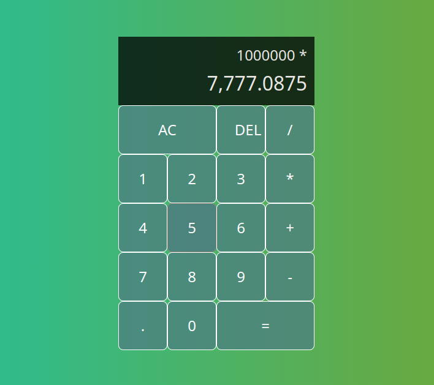

# React Calculator

### Features

- Calculator logic built with useReducer
- Logic to prevent extra zeros and decimals
- Integer formatter to add commas for thousands, and also allow decimals
- CSS Grid to style the calculator
